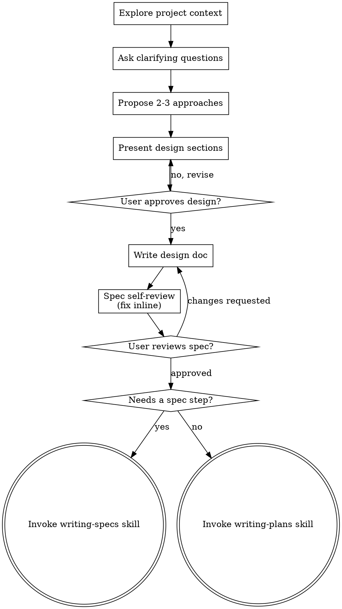

# Brainstorming Ideas Into Designs

Help turn ideas into fully formed designs and specs through natural collaborative dialogue.

Start by understanding the current project context, then ask questions one at a time to refine the idea. Once you understand what you're building, present the design and get user approval.

<HARD-GATE>
Do NOT invoke any implementation skill, write any code, scaffold any project, or take any implementation action until you have presented a design and the user has approved it. This applies to EVERY project regardless of perceived simplicity.
</HARD-GATE>

## Anti-Pattern: "This Is Too Simple To Need A Design"

Every project goes through this process. A todo list, a single-function utility, a config change — all of them. "Simple" projects are where unexamined assumptions cause the most wasted work. The design can be short (a few sentences for truly simple projects), but you MUST present it and get approval.

## Checklist

You MUST create a task for each of these items and complete them in order:

1. **Explore project context** — check files, docs, recent commits
2. **Offer the visual companion just-in-time** — NOT upfront. The first time a question would genuinely be clearer shown than described, offer it then (its own message); on approval its browser tab opens for you. If no visual question ever arises, never offer it. See the Visual Companion section below.
3. **Ask clarifying questions** — one at a time, understand purpose/constraints/success criteria
4. **Propose 2-3 approaches** — with trade-offs and your recommendation
5. **Present design** — in sections scaled to their complexity, get user approval after each section
6. **Write design doc** — build it from the Design Document Template, save to `.plans/specs/YYYY-MM-DD-<topic>-design.html` (see After the Design) and commit
7. **Spec self-review** — quick inline check for placeholders, contradictions, ambiguity, scope (see below)
8. **User reviews written spec** — ask user to review the spec file before proceeding
9. **Transition to the next skill** — invoke writing-specs when the project's process includes a spec step or the work needs the precision layer (exact code regions, contract changes, edge-case table) before planning; otherwise invoke writing-plans directly (see the terminal-state note under Process Flow)

## Process Flow



**The terminal state is invoking the next planning skill — conditionally.** Invoke **writing-specs** when the project's process includes a spec step, or when the work needs the precision layer (exact code regions staged for the planning agent, contract/schema/API changes, an edge-case/risk table) before planning. Otherwise invoke **writing-plans** directly. writing-specs itself hands off onward (→ acceptance-testing → writing-plans), so either path ends at a plan. Do NOT invoke frontend-design, mcp-builder, or any other implementation skill — the only skills you invoke after brainstorming are writing-specs or writing-plans.

## The Process

**Understanding the idea:**

- Check out the current project state first (files, docs, recent commits)
- Before asking detailed questions, assess scope: if the request describes multiple independent subsystems (e.g., "build a platform with chat, file storage, billing, and analytics"), flag this immediately. Don't spend questions refining details of a project that needs to be decomposed first.
- If the project is too large for a single spec, help the user decompose into sub-projects: what are the independent pieces, how do they relate, what order should they be built? Then brainstorm the first sub-project through the normal design flow. Each sub-project gets its own spec → plan → implementation cycle.
- For appropriately-scoped projects, ask questions one at a time to refine the idea
- Prefer multiple choice questions when possible, but open-ended is fine too
- Only one question per message - if a topic needs more exploration, break it into multiple questions
- Focus on understanding: purpose, constraints, success criteria

**Exploring approaches:**

- Propose 2-3 different approaches with trade-offs
- Present options conversationally with your recommendation and reasoning
- Lead with your recommended option and explain why

**Presenting the design:**

- Once you believe you understand what you're building, present the design
- Scale each section to its complexity: a few sentences if straightforward, up to 200-300 words if nuanced
- Ask after each section whether it looks right so far
- Cover: success criteria, user stories, architecture, components, data flow, error handling, testing
- Be ready to go back and clarify if something doesn't make sense

**Design for isolation and clarity:**

- Break the system into smaller units that each have one clear purpose, communicate through well-defined interfaces, and can be understood and tested independently
- For each unit, you should be able to answer: what does it do, how do you use it, and what does it depend on?
- Can someone understand what a unit does without reading its internals? Can you change the internals without breaking consumers? If not, the boundaries need work.
- Smaller, well-bounded units are also easier for you to work with - you reason better about code you can hold in context at once, and your edits are more reliable when files are focused. When a file grows large, that's often a signal that it's doing too much.

**Working in existing codebases:**

- Explore the current structure before proposing changes. Follow existing patterns.
- Where existing code has problems that affect the work (e.g., a file that's grown too large, unclear boundaries, tangled responsibilities), include targeted improvements as part of the design - the way a good developer improves code they're working in.
- Don't propose unrelated refactoring. Stay focused on what serves the current goal.

## After the Design

**Documentation:**

- Write the validated design (spec) to `.plans/specs/YYYY-MM-DD-<topic>-design.html`
  - (User preferences for spec location override this default)
  - **Design docs are HTML, not markdown** — read by humans in a browser and by agents.
    Build the file from the **Design Document Template** below: a single self-contained
    dark-theme file (inline `<style>`, no external assets) that shares the visual skeleton of
    the writing-plans plan template.
  - **Open with Purpose / Problem / Solution.** A reader with no other context must be able to
    understand what this is, what problem it solves, and what the answer is *before* hitting any
    architectural detail. This is the top of every design doc, not optional — it's the fix for
    design docs that dive into mechanics with no high-level overview.
  - **Acceptance criteria are a design concern, not a downstream one.** The design carries the
    Success Criteria and User Stories, so the owner approves a design already knowing what DONE
    means. Downstream specs and plans *reference* the design's criteria rather than restating
    them — one home per fact, no drift. Success criteria must be testable (positive and
    negative); a design without them is not approvable. User stories are grouped by persona,
    and where the project defines testing personas (e.g. operator / developer /
    security-reviewer), draw them from there.
- Use elements-of-style:writing-clearly-and-concisely skill if available
- Commit the design document to git

**Template discipline:**

- The template uses `{{PLACEHOLDER}}` slots — replace EVERY `{{...}}` with real content. A
  finished design doc contains zero `{{}}` tokens.
- Blocks marked `<!-- repeat -->` are repeatable: duplicate them as many times as the design
  needs (one row per decision, one entry per relevant file, one entry per questionable) and
  delete the marker comments.
- The metadata header is updatable across the doc's life: every field except `created` is an
  append-only comma-separated list — append new entries, never overwrite or remove existing ones.
- Leave the **Amendments** section empty at creation; it records only post-approval changes.

**Spec Self-Review:**
After writing the spec document, look at it with fresh eyes:

1. **Placeholder scan:** Any "TBD", "TODO", incomplete sections, or vague requirements? Fix them.
2. **Internal consistency:** Do any sections contradict each other? Does the architecture match the feature descriptions?
3. **Scope check:** Is this focused enough for a single implementation plan, or does it need decomposition?
4. **Ambiguity check:** Could any requirement be interpreted two different ways? If so, pick one and make it explicit.

Fix any issues inline. No need to re-review — just fix and move on.

**User Review Gate:**
After the spec review loop passes, ask the user to review the written spec before proceeding:

> "Spec written and committed to `<path>`. Please review it and let me know if you want to make any changes before we start writing out the implementation plan."

Wait for the user's response. If they request changes, make them and re-run the spec review loop. Only proceed once the user approves.

**Next skill (conditional):**

- If the project's process includes a spec step, or the work needs the precision layer
  (exact code regions staged for the planning agent, contract/schema/API changes, an
  edge-case/risk table) before planning — invoke the **writing-specs** skill. It turns this
  design into a code-level spec, then hands off to acceptance-testing and writing-plans.
- Otherwise, invoke the **writing-plans** skill directly to create the implementation plan.
- Do NOT invoke any other skill. writing-specs or writing-plans is the next step.

## Design Document Template

Build the design doc from this template. It shares the dark, self-contained skeleton the
writing-plans plan template uses (same `:root` palette, single inline `<style>`, no external
assets), so a spec and its plan read as one system.

```html
<!DOCTYPE html>
<html lang="en">
<head>
<meta charset="utf-8">
<title>{{TOPIC}} — Design</title>
<style>
  :root{--bg:#0f1115;--card:#181b22;--card2:#1e222b;--line:#2a2f3a;--fg:#e6e9ef;--mut:#9aa4b2;
        --todo:#3b82f6;--done:#22c55e;--accent:#38bdf8;--new:#22c55e;--existing:#9aa4b2;}
  body{margin:0;background:var(--bg);color:var(--fg);
       font:15px/1.6 -apple-system,BlinkMacSystemFont,"Segoe UI",Roboto,sans-serif;}
  .wrap{max-width:940px;margin:0 auto;padding:32px 24px 80px}
  code,pre{background:#20242d;border-radius:4px;font:12.5px/1.5 ui-monospace,Menlo,monospace;color:#cfe3ff}
  code{padding:1px 6px} pre{padding:12px;overflow-x:auto} pre code{padding:0;background:none}
  h1{font-size:26px;margin:0 0 6px}
  h2{font-size:16px;text-transform:uppercase;letter-spacing:.03em;color:var(--mut);
     margin:34px 0 12px;padding-bottom:6px;border-bottom:1px solid var(--line)}
  p{margin:8px 0}
  .meta{background:var(--card);border:1px solid var(--line);border-radius:10px;padding:14px 18px;margin:16px 0}
  .meta summary{cursor:pointer;color:var(--mut);font-weight:600}
  .meta dl{display:grid;grid-template-columns:max-content 1fr;gap:4px 16px;margin:12px 0 0}
  .meta dt{color:var(--mut)} .meta dd{margin:0}
  table{border-collapse:collapse;width:100%;margin:8px 0;font-size:13.5px}
  th,td{border:1px solid var(--line);padding:8px 10px;text-align:left;vertical-align:top}
  th{background:var(--card2);color:var(--mut);text-transform:uppercase;letter-spacing:.03em;font-size:12px}
  ul.files{list-style:none;padding-left:0} ul.files>li{margin:6px 0}
  .tag{font-size:11px;text-transform:uppercase;letter-spacing:.03em;padding:1px 7px;border-radius:999px;border:1px solid}
  .tag.existing{color:var(--existing);border-color:var(--existing)}
  .tag.new{color:var(--new);border-color:var(--new)}
  details.item{background:var(--card);border:1px solid var(--line);border-radius:10px;padding:10px 14px;margin:10px 0}
  details.item summary{cursor:pointer;font-weight:600}
</style>
</head>
<body><div class="wrap">

<!-- ===== HEADER + UPDATABLE METADATA ===== -->
<h1>{{TOPIC}} — Design</h1>
<details class="meta">
  <summary>Metadata</summary>
  <dl>
    <dt>created</dt>      <dd>{{CREATED_ISO}}</dd>
    <dt>modified</dt>     <dd>{{MODIFIED_ISO_LIST}}</dd>
    <dt>commits</dt>      <dd>{{COMMIT_SHA_LIST}}</dd>
    <dt>agents</dt>       <dd>{{AGENT_NAME_LIST}}</dd>
    <dt>sessions</dt>     <dd>{{SESSION_ID_LIST}}</dd>
    <dt>back refs</dt>    <dd>{{BACK_REFERENCES}}</dd>
    <dt>forward refs</dt> <dd>{{FORWARD_REFERENCES}}</dd>
  </dl>
</details>

<!-- ===== PURPOSE / PROBLEM / SOLUTION — a reader with NO other context starts here ===== -->
<h2>Purpose</h2>
<p>{{PURPOSE: what this is, in plain language — one paragraph a newcomer can understand}}</p>

<h2>Problem</h2>
<p>{{PROBLEM: what's broken or missing today, and why it matters}}</p>

<h2>Solution</h2>
<p>{{SOLUTION: the answer, at a high level, before any mechanics}}</p>

<!-- ===== SUCCESS CRITERIA — the design is not approvable without them ===== -->
<h2>Success Criteria</h2>
<p>Each criterion is a testable outcome — if you can't test it, rewrite it. Include positive
   (it works) and negative (it rejects bad input) criteria. The design is not approvable
   without them.</p>
<ol>
  <!-- repeat: one numbered criterion per testable outcome -->
  <li>{{SUCCESS_CRITERION: a single outcome you can prove pass or fail}}</li>
</ol>

<!-- ===== USER STORIES — grouped by persona ===== -->
<h2>User Stories</h2>
<!-- repeat: one <h3> + list per persona. Personas come from the project's testing rules
     (e.g. operator / developer / security-reviewer) where such rules exist. -->
<h3>{{PERSONA}}</h3>
<ul>
  <!-- repeat: one story per line -->
  <li>As a(n) {{PERSONA}}, I want {{ACTION}} so that {{BENEFIT}}.</li>
</ul>

<!-- ===== DECISIONS — forks resolved with the owner during brainstorming ===== -->
<h2>Decisions</h2>
<table>
  <thead><tr><th>Fork</th><th>Decision</th><th>Rationale</th></tr></thead>
  <tbody>
    <!-- repeat: one row per resolved fork -->
    <tr><td>{{FORK}}</td><td>{{DECISION}}</td><td>{{RATIONALE}}</td></tr>
  </tbody>
</table>

<!-- ===== DESIGN DETAIL ===== -->
<h2>Architecture</h2>
<p>{{ARCHITECTURE: the shape of the system and how the pieces fit}}</p>

<h2>Components</h2>
<p>{{COMPONENTS: each unit, its one responsibility, and its interface}}</p>

<h2>Data Flow</h2>
<p>{{DATA_FLOW: how data moves through the system, request to response}}</p>

<h2>Error Handling</h2>
<p>{{ERROR_HANDLING: failure modes and how each is handled}}</p>

<h2>Testing</h2>
<p>{{TESTING: how the design is validated — what proves it works}}</p>

<!-- ===== RELEVANT FILES ===== -->
<h2>Relevant Files</h2>
<ul class="files">
  <!-- repeat -->
  <li><span class="tag existing">existing</span> <code>{{EXISTING_FILE_PATH}}</code> — {{WHY_RELEVANT}}</li>
  <!-- repeat -->
  <li><span class="tag new">new</span> <code>{{NEW_FILE_PATH}}</code> — {{WHY_NEEDED}}</li>
</ul>

<!-- ===== QUESTIONABLES — open questions/assumptions surfaced, not silently decided ===== -->
<h2>Questionables</h2>
<!-- repeat: one entry per open question, assumption, or risk -->
<details class="item">
  <summary>{{QUESTIONABLE}}</summary>
  <p>{{ASSUMPTION_OR_RATIONALE: what you assumed and why, or what still needs an answer}}</p>
</details>

<!-- ===== AMENDMENTS — append-only, EMPTY at creation; post-approval changes only ===== -->
<h2>Amendments</h2>
<!-- repeat: one entry per amendment, newest at the bottom. Leave empty at creation. -->
<details class="item">
  <summary>{{AMEND_ISO}} — {{AMEND_SUMMARY}}</summary>
  <p>{{AMEND_DETAIL: what changed after approval, and why}}</p>
</details>

</div></body></html>
```

## Key Principles

- **One question at a time** - Don't overwhelm with multiple questions
- **Multiple choice preferred** - Easier to answer than open-ended when possible
- **YAGNI ruthlessly** - Remove unnecessary features from all designs
- **Explore alternatives** - Always propose 2-3 approaches before settling
- **Incremental validation** - Present design, get approval before moving on
- **Be flexible** - Go back and clarify when something doesn't make sense

## Visual Companion

A browser-based companion for showing mockups, diagrams, and visual options during brainstorming. Available as a tool — not a mode. Accepting the companion means it's available for questions that benefit from visual treatment; it does NOT mean every question goes through the browser.

**Offering the companion (just-in-time):** Do NOT offer it upfront. Wait until a question would genuinely be clearer shown than told — a real mockup / layout / diagram question, not merely a UI *topic*. The first time that happens, offer it then, as its own message:
> "This next part might be easier if I show you — I can put together mockups, diagrams, and comparisons in a browser tab as we go. It's still new and can be token-intensive. Want me to? I'll open it for you."

**This offer MUST be its own message.** Only the offer — no clarifying question, summary, or other content. Wait for the user's response. If they accept, start the server with `--open` so their browser opens to the first screen automatically. If they decline, continue text-only and don't offer again unless they raise it.

**Per-question decision:** Even after the user accepts, decide FOR EACH QUESTION whether to use the browser or the terminal. The test: **would the user understand this better by seeing it than reading it?**

- **Use the browser** for content that IS visual — mockups, wireframes, layout comparisons, architecture diagrams, side-by-side visual designs
- **Use the terminal** for content that is text — requirements questions, conceptual choices, tradeoff lists, A/B/C/D text options, scope decisions

A question about a UI topic is not automatically a visual question. "What does personality mean in this context?" is a conceptual question — use the terminal. "Which wizard layout works better?" is a visual question — use the browser.

If they agree to the companion, read the detailed guide before proceeding:
`skills/brainstorming/visual-companion.md`
